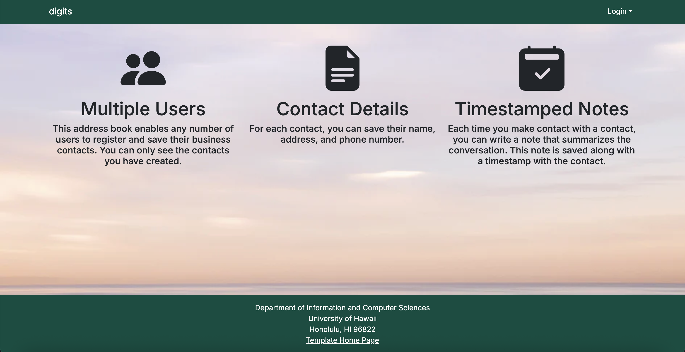
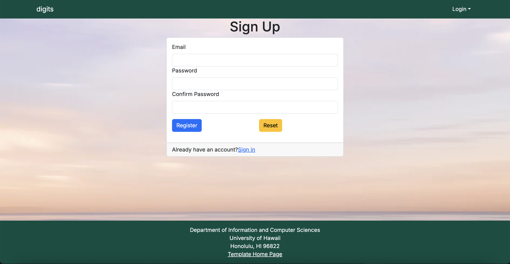
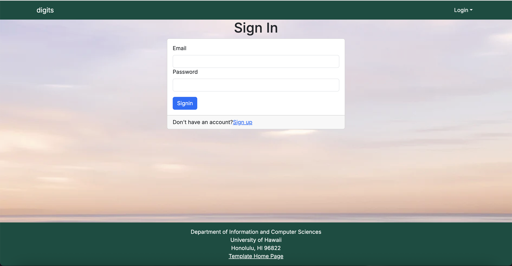
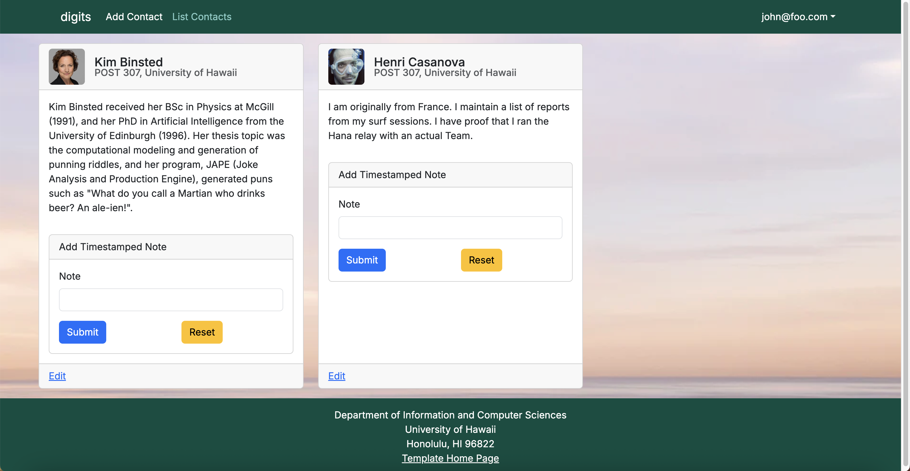
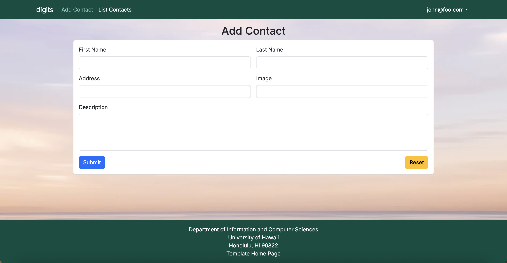

Digits is an application that allows users to:

- Register an account  
- Create and manage a set of contacts  
- Add timestamped notes about interactions with each contact  

This version of Digits is built with **Next.js 14**, **Prisma**, **NextAuth**, and **React Bootstrap**. The main goal is to provide a simple example of a full-stack web application where users can log in and keep track of people they know and any notes they want to record.

---

## Installation

### 1. Install PostgreSQL
Install PostgreSQL from https://www.postgresql.org/download/.

Create your database:

\```bash
createdb digits
\```

### 2. Download your Digits repository
Clone your copy of the project:

\```bash
git clone https://github.com/<your-username>/<your-digits-repo>.git
cd <your-digits-repo>
\```

### 3. Install libraries

\```bash
npm install
\```

### 4. Create your environment file  
Copy `.env.sample` into `.env` and fill in the required values:

\```bash
DATABASE_URL="postgresql://localhost:5432/digits"
\```

Add your NEXTAUTH secrets as well.

### 5. Set up your database
Run the Prisma migration:

\```bash
npx prisma migrate dev
\```

Then seed the database with default users and contacts:

\```bash
npx prisma db seed
\```

You should see output showing users and contacts being created.

---

## Running the application

Start the system with:

\```bash
npm run dev
\```

If everything works, the application will be running at:

http://localhost:3000

You can log in using the users defined in `config/settings.development.json`, or you can register a new account.

---

## ESLint

You can run ESLint to check for style problems:

\```bash
npm run lint
\```

---

# User Interface Walkthrough

## Landing Page

When you first open the application, you’ll see the landing page:


This page gives a brief introduction and links to sign in or sign up.

---

## Register

If you don’t have an account, click **Sign Up**:



Enter your information to create a new user.

---

## Sign In

If you already have an account, click **Sign In**:



Once logged in, the navbar will update to show options for listing contacts and adding new ones.

---

## User Home Page

After logging in, you return to a landing-style page, but the navbar now includes authenticated options:

- List Contacts  
- Add Contact  
- Sign Out  

This lets you start managing your contacts.

---

## List Contacts

Clicking **List Contacts** shows all of the contacts belonging to the logged-in user:



From here, you can:

- View your saved contacts  
- Edit a contact  
- Write notes about the contact  

---

## Add Contact

You can add a new contact with the **Add Contact** form:



Enter the person’s details and save them.

---

## Notes

Each contact has a page where you can write timestamped notes about interactions with them.  
This is useful for recording conversations, reminders, meetings, or anything important you want to remember later.

---

## Admin Mode (If enabled)

If a user is assigned the **Admin** role in the settings file, an extra link appears in the navbar.  
Admins can view **all contacts** from **all users** in the system.

Regular users cannot access this page.

---

## Summary

Digits provides a simple but complete example of a full-stack web application where users can:

- Register and log in  
- Manage contacts  
- Record timestamped notes  
- (If admin) View all users’ contacts  

This app demonstrates how authentication, databases, forms, routing, and UI all work together in a modern web framework.
